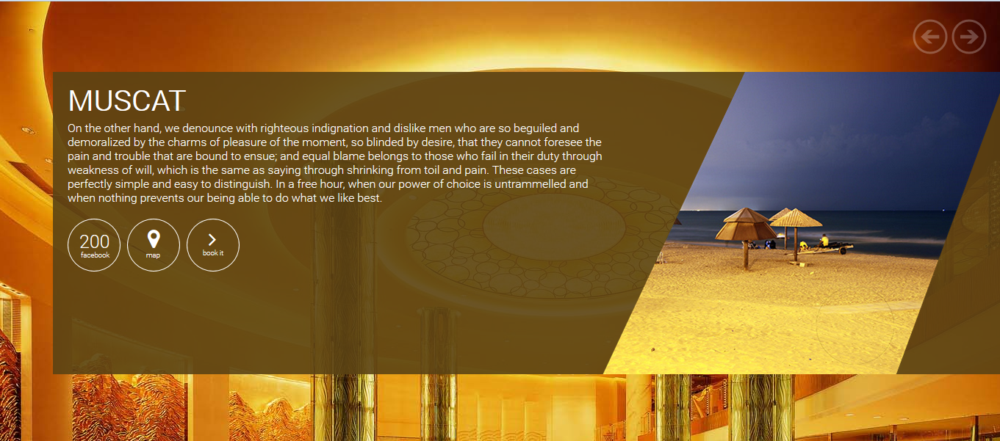
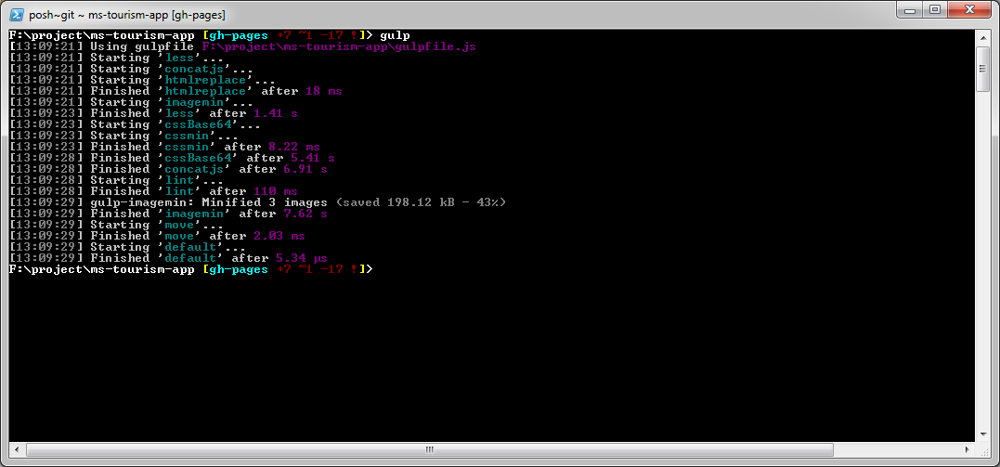
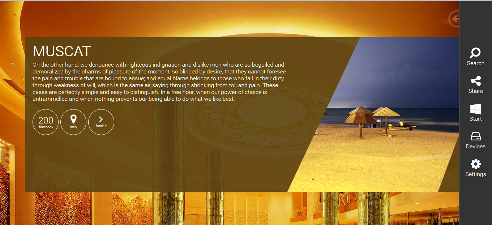
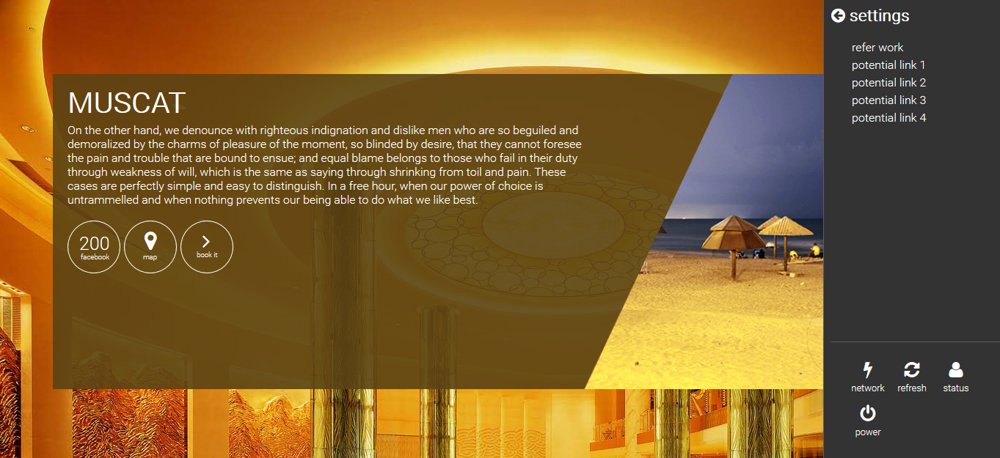
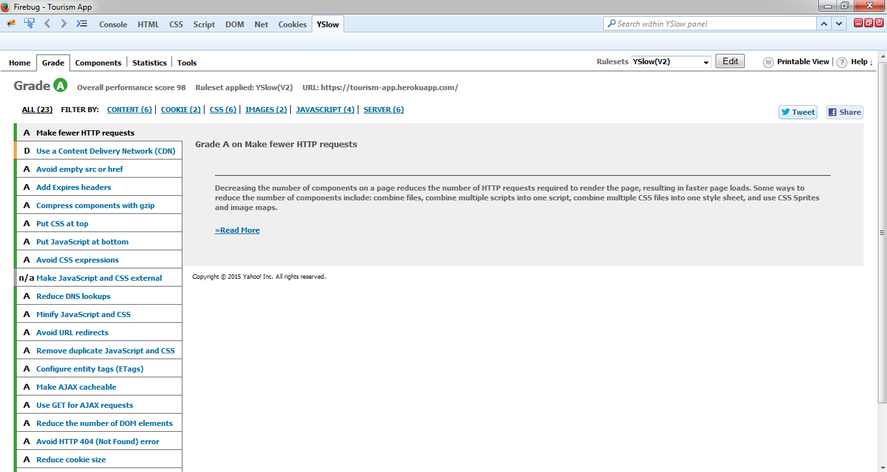

# Tourism App 
Demo - http://hs105133.github.io/ms-tourism-app/public/



### Important Links
Source Code - https://github.com/hs105133/ms-tourism-app/tree/gh-pages

Development - http://hs105133.github.io/ms-tourism-app/

Production url - `optimized for the web` - https://tourism-app.herokuapp.com/


## Devlopment Setup

All frontend stuff goes inside `public` folder

```
cd ms-tourism-app
npm install
gulp watch
// now do any changes in html, js or less folder 
```

open another terminal if you need server

```
node server.js
// http://localhost:5000/
```

## Build Process

```
cd ms-tourism-app ( gulpfile.js located here ) 
gulp
```


it will create `build` folder inside `ms-tourism-app/public`, this is what you want to deploy on production server 

## Screens

### flyout menu



### setting options



### YSLOW performance report




